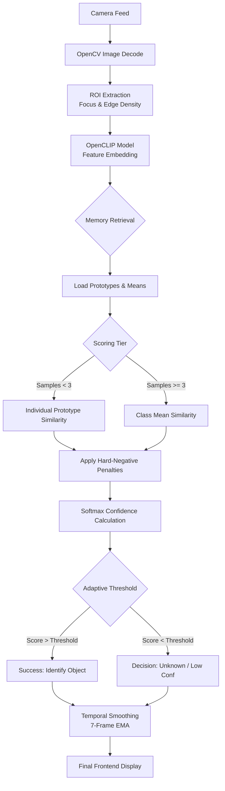
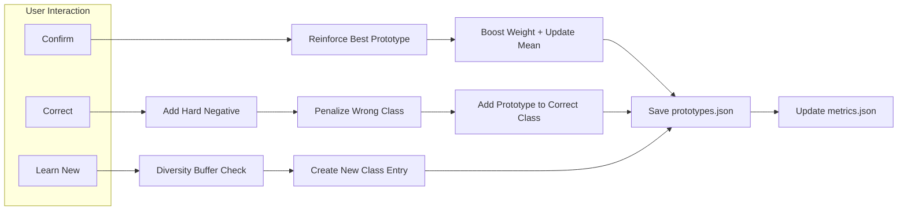

# IntelShareAI: Algorithm Flowchart

This document visualizes the "Thinking Eye" of the IntelShareAI system, mapping out how the AI perceives objects and learns from your feedback in real-time.

---

## 🔍 1. Real-Time Inference Loop
This flow happens continuously (multiple times per second) as the camera looks for objects.

---

## 🛠️ 2. Learning & Feedback Loop
This flow is triggered when you interact with the AI (Confirm, Correct, or Teach).

---

## 💡 Key Design Principles
*   **Dual-Tier Memory**: Uses fast "Individual Match" for new items and robust "Mean Match" for experts.
*   **Hard-Negative Mining**: Remembers mistakes specifically to subtract points from similar confusing views.
*   **Temporal Stability**: Prevents flickering using Exponential Moving Averages (EMA).
*   **Class-Aware Thresholds**: Each object has its own pass-mark based on how well the AI knows it.
