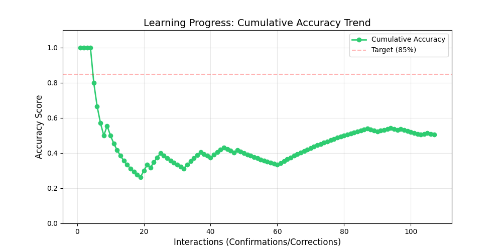
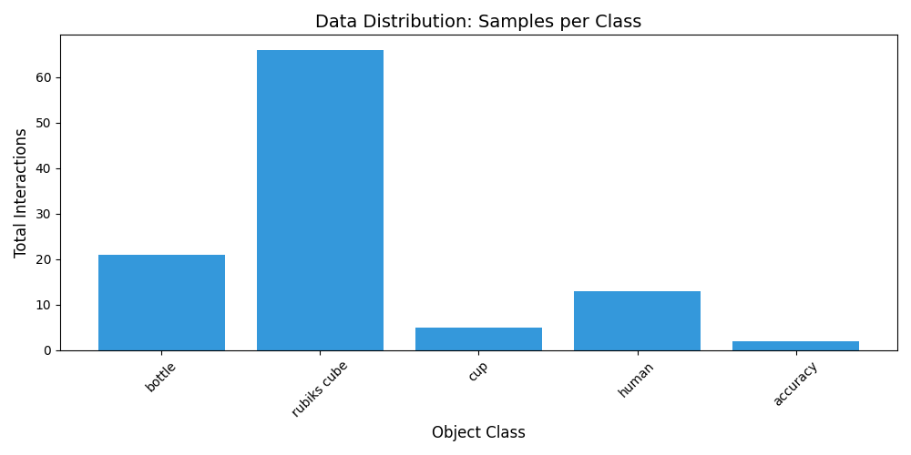

# Performance Intelligence Report

**Timestamp:** Tue Mar  3 23:16:59 2026

## Summary Stats
- **Global Accuracy:** 50.47%
- **Total Feedbacks:** 107
- **Target samples per class:** 30 (Current progress: 21.4 avg)

## Visual Trends
### 📈 Accuracy Progress

### 📊 Class Distribution

## Per-Class Breakdown
| Class | Samples | Precision (Est.) |
| :--- | :--- | :--- |
| bottle | 21 | 19.0% |
| rubiks cube | 66 | 66.7% |
| cup | 5 | 40.0% |
| human | 13 | 30.8% |
| accuracy | 2 | 0.0% |
